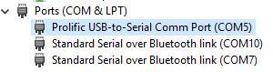

Using a [JBtek FTDI cable](https://www.amazon.com/JBtek%C2%AE-WINDOWS-Supported-Raspberry-Programming/dp/B00QT7LQ88/ref=sr_1_1?ie=UTF8&qid=1480442438&sr=8-1&keywords=jbtek+ttl+serial+cable) we can use the following connections:

* ~~Power (RED) to Power Pin 2~~ (If power is supplied through another source, do not connect this pin)
* Ground (BLACK) to Ground Pin 15
* TX (Green) to UART RX Pin 69
* RX (White) to UART TX Pin 68

## Setup libraries
`pip install requirements.txt` to install libraries and setup the Python scripts from running.

## Reading over UART

Use the Windows Device Manager to find the `Prolific USB-to-Serial Comm Port` and identify the port number. (In my case, it is COM5).

Use the Python script in the [Embedded-Library-Tests](https://gitlab.com/memsat/Embedded-Library-Tests) project to read over serial, using your port number (the default is `COM14`).

`python debug.py {port #} {baud rate}`

The baud rate should be `38400`. In my case, I'd execute the following in a terminal window:

`python debug.py 5 38400`

Then it will start reading the serial connection. 

[Embedded Library Tests](/docs/test/) employ UART to verify functionality remotely.